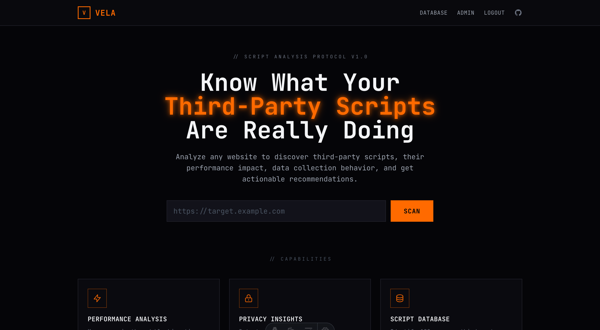
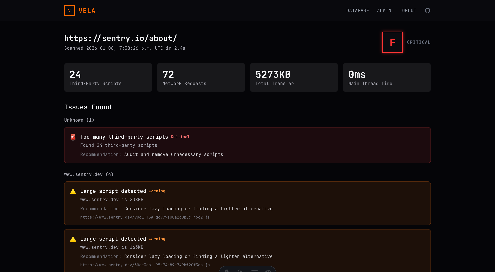

# Vela

A third-party script auditor that analyzes websites to identify tracking scripts, their performance impact, and privacy concerns. Runs entirely on Cloudflare's edge platform.

## Features

- Scan websites for third-party scripts
- Identify script vendors and purposes (analytics, ads, social, etc.)
- Analyze performance impact of each script
- Detect privacy concerns (cookies, fingerprinting, data collection)
- Grade overall script health
- **Admin panel** for managing script patterns
- **Authentication** with email/password
- **Role-based access control** (user, editor, admin)

## Screenshots





## Tech Stack

- **Runtime**: Cloudflare Workers + Pages
- **API**: [Hono](https://hono.dev/) (lightweight, edge-compatible)
- **Frontend**: [Astro](https://astro.build/) + Tailwind CSS
- **Database**: Cloudflare D1 (SQLite) with [Drizzle ORM](https://orm.drizzle.team/)
- **Authentication**: [better-auth](https://www.better-auth.com/) (email/password)
- **Caching**: Cloudflare KV
- **Browser Automation**: Cloudflare Browser Rendering (Puppeteer)
- **Monorepo**: [Turborepo](https://turbo.build/) + pnpm workspaces

## Project Structure

```
vela/
├── apps/
│   ├── api/          # Hono REST API (Cloudflare Workers)
│   │   └── src/
│   │       ├── db/           # Drizzle schema & client
│   │       ├── lib/          # Auth configuration
│   │       ├── middleware/   # Auth middleware
│   │       ├── routes/       # API routes (scans, scripts, auth, admin)
│   │       ├── services/     # Business logic (scan, pattern, browser)
│   │       └── utils/        # URL utilities
│   └── web/          # Astro frontend (Cloudflare Pages)
│       └── src/
│           ├── layouts/      # Base & Admin layouts
│           ├── lib/          # Auth client
│           └── pages/        # Public, auth, and admin pages
├── packages/
│   ├── shared/       # Shared TypeScript types
│   ├── script-db/    # Script pattern database (legacy)
│   └── typescript-config/  # Shared tsconfig presets
├── migrations/       # D1 database migrations
└── scripts/          # CLI tools (pattern management)
```

## Prerequisites

- Node.js >= 20
- pnpm 9.x

## Getting Started

1. **Install dependencies**

   ```bash
   pnpm install
   ```

2. **Set up local database**

   ```bash
   pnpm db:migrate:local
   ```

3. **Seed test patterns** (optional)

   ```bash
   pnpm patterns:seed
   ```

4. **Set auth secret** (for local development, create `.dev.vars` in `apps/api/`)

   ```bash
   # apps/api/.dev.vars
   BETTER_AUTH_SECRET=your-secret-key-here
   ```

   Generate a secret with: `openssl rand -base64 32`

5. **Start development servers**

   ```bash
   pnpm dev
   ```

   This starts both the API worker (http://localhost:8787) and web frontend (http://localhost:4321).

6. **Create an admin account**

   ```bash
   pnpm admin:seed --email admin@example.com --password your-password --name "Admin"
   ```

   Note: The dev server must be running (`pnpm dev`) for this command to work.

## Commands

| Command                  | Description                    |
| ------------------------ | ------------------------------ |
| `pnpm dev`               | Start all apps in dev mode     |
| `pnpm build`             | Build all packages and apps    |
| `pnpm typecheck`         | Type check entire monorepo     |
| `pnpm lint`              | Lint with oxlint               |
| `pnpm format`            | Format with Prettier           |
| `pnpm db:migrate:local`  | Apply migrations locally       |
| `pnpm db:migrate:remote` | Apply migrations to production |
| `pnpm patterns`          | Pattern management CLI         |
| `pnpm patterns:seed`     | Seed test patterns             |
| `pnpm admin:seed`        | Create an admin user           |

### Per-App Commands

```bash
# API (Cloudflare Workers)
cd apps/api
pnpm dev        # Start API worker
pnpm deploy     # Deploy to Cloudflare Workers

# Web (Cloudflare Pages)
cd apps/web
pnpm dev        # Start Astro dev server
pnpm deploy     # Deploy to Cloudflare Pages
```

### Pattern Management CLI

```bash
pnpm patterns list [--category <cat>]    # List all patterns
pnpm patterns get <id>                   # Get pattern details
pnpm patterns add --id <id> --name "..." --vendor "..." --category "..." --url-patterns "..."
pnpm patterns delete <id>                # Soft delete
pnpm patterns export                     # Export to JSON
pnpm patterns import --file <file>       # Import from JSON
pnpm patterns seed                       # Seed test patterns
```

## Authentication & Roles

**Roles:**

- `user` - Default role, public access only
- `editor` - Can manage script patterns (CRUD operations)
- `admin` - Full access including user management

**Auth Methods:**

- Email/password login (admin users created via CLI)

## API Endpoints

### Public

- `GET /health` - Health check
- `POST /scans` - Create a new scan
- `GET /scans/:id` - Get scan results
- `GET /scripts` - List known script patterns
- `POST /scripts/identify` - Identify a script URL

### Auth (`/api/auth/*`)

- `POST /api/auth/sign-in/email` - Login
- `POST /api/auth/sign-out` - Logout
- `GET /api/auth/get-session` - Current session

### Admin (`/admin/*` - requires auth)

- `GET /admin/patterns` - List patterns (editor+)
- `POST /admin/patterns` - Create pattern (editor+)
- `PUT /admin/patterns/:id` - Update pattern (editor+)
- `DELETE /admin/patterns/:id` - Delete pattern (editor+)
- `GET /admin/users` - List users (admin only)
- `PUT /admin/users/:id/role` - Update user role (admin only)
- `DELETE /admin/users/:id` - Delete user (admin only)

## Cloudflare Bindings

The API worker uses:

- `DB` - D1 database for scans, patterns, and auth
- `SCAN_CACHE` - KV namespace for result caching
- `RATE_LIMIT` - KV namespace for rate limiting
- `BROWSER` - Browser Rendering binding for Puppeteer

**Required Secrets:**

```bash
wrangler secret put BETTER_AUTH_SECRET    # Required - generate with: openssl rand -base64 32
wrangler secret put WEB_URL               # Required for production - your frontend URL (e.g., https://vela.example.com)
```

## License

MIT
